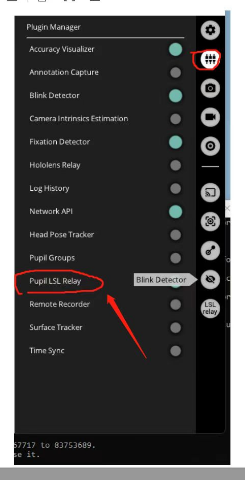

# PsychoPy - Lab Streaming Layer - Pupil Capture integration
---
Use [Python 3](https://www.python.org/), [PsychoPy](https://www.psychopy.org/), [Pupil Capture](https://docs.pupil-labs.com/core/software/pupil-capture/), [lab streaming layer (LSL)](https://labstreaminglayer.org/#/) and [pylsl](https://github.com/labstreaminglayer/pylsl) to synchronize eye-tracking data with markers from stimuli, using two connected PCs.

## Aim
To create a solution for recording eye-tracking data (Pupil Core) and synchronizing it with markers generated by stimuli presented in PsychoPy, using two **Windows 10/11** PCs in local network.

## Problem
Pupil Capture is the software for recording pupil and gaze data from the Pupil Core eye-tracking device. A typical scenario is to use an external application to present stimuli, such as PsychoPy which is an open-source software written in Python. However, in order to synchronize the eye-tracking data with the stimuli, the application needs to be aware of the time of each stimulus presentation. This is not always possible, especially when the application is running on a different computer. Moreover, the clocks used by different apps and different PCs may spit out different timestamps. Thus, it is not possible to reliably synchronize the data streams. 

## Solution
Lab streaming layer (LSL) is a protocol for synchronizing data streams between applications and PCs. It is a network protocol that allows applications to send (or broadcast) time-stamped data and metadata over a network. The synced data can be then recorded and processed by other applications such as [Lab Recorder](https://github.com/labstreaminglayer/App-LabRecorder). Pupil Capture allows to use the Pupil LSL Relay plugin which receives the data from broadcast streams, e.g. sent by PsychoPy. 

## Configuration steps

### On PC 1. (i.e. presenting stimuli)
#### 1. Install PsychoPy and create an experiment using the Builder.
#### 2. In the beginning routine add a Code component (Begin Experiment tab) which opens an LSL outlet:
```python
from pylsl import StreamInfo, StreamOutlet

info = StreamInfo(name="marker_stream", type="Markers", channel_count=1, channel_format='int32', source_id='example_stream_999')
outlet = StreamOutlet(info)
outlet.push_sample(x=[100])
```
*Note*: marker `100` is an example marker code for the beginning of the experiment.

#### 3. In each (looped) routine with a stimulus which needs to be synced with eye-tracking data, add a Code component which pushes a marker to the LSL outlet.

In the Begin Routine tab:
```python
outlet.push_sample(x=[stim_on])
```
In the End Routine tab:
```python
outlet.push_sample(x=[stim_off])
```
*Note*: `stim_on` and `stim_off` are example marker variables which are set in the PsychoPy loop settings.

#### 4. Connect the LAN cable (use crossover cable if necessary, but straight cable will probably work too).

#### 5. Configure ethernet connection: 
Control Panel -> Network and Internet -> Network and Sharing Center -> Change adapter settings -> Ethernet -> Properties -> Internet Protocol Version 4 (TCP/IPv4) -> Properties -> Use the following IP address: 192.168.1.1 and the subnet mask: 255.255.255.0 -> OK

Set the network as private and **turn off the firewall** (both Windows Defender and any other additional software) only for private networks (leave the firewall on for public networks!). If you have Windows Home edition, you will need to keep the network public, because Microsoft does not allow to change it (at least in 2024).

---
### On PC 2. (i.e. recording eye-tracking data and receiving markers)

#### 1. Install Pupil Capture (and the rest of the Pupil software stack)

#### 2. Install the Pupil LSL Relay plugin:
In the user *plugin directory* (*pupil_capture_settings\plugins\\*) place the folder [pylsl](https://github.com/labstreaminglayer/pylsl/tree/master/pylsl) with all its contents. If the lsl library is not available globally, you should copy the [lsl.dll](https://github.com/sccn/liblsl/releases) file to the subfolder *\lib* of the *pylsl* folder.
Copy the corresponding plugins ([pupil_capture_lsl_recorder.py file or pupil_capture_lsl_relay folder](https://github.com/labstreaminglayer/App-PupilLabs/tree/master/pupil_capture)) to the same *plugin directory*. 

The structure of the Pupil Capture settings folder should be:
```bash
├── pupil_capture_settings
│   ├── plugins
│   │    ├── pylsl
│   │    │   ├── pylsl.py
│   │    │   ├── lib
│   │    │       ├── lsl.dll
│   │    └── pupil_capture_lsl_recorder.py/pupil_capture_lsl_relay

```

If the plugin was installed correctly, it should appear in the Plugin Manager of Pupil Capture:




#### 3. Help LSL receiver to find the stream:

Create a directory `C:\etc\lsl_api\` and copy `lsl_api.cfg` file there. Use [these cool tips](https://www.brainproducts.com/support-resources/tips-and-tricks-for-lsl/) if needed.

*Note*: The most important part of the file (overriding the default setttings) is the one that specifies IP addresses. This really helps when streams are not found, even if PCs are connected and they ping each other properly.
```bash
[lab]
KnownPeers = {192.168.1.1, 192.168.1.2}
```

#### 4. Connect the second ending of the LAN cable.

#### 5. Configure ethernet connection:
Repeat the step 4. for PC 1. but use the following IP address: 192.168.1.2

---
*Note*: If you plan to use the same computer for both recording and presenting stimuli, you can skip steps 4 and 5.

## Usage
1. Run PsychoPy experiment on PC 1.
2. Run Pupil Capture on PC 2. and activate the LSL Relay plugin. You should see the name of your LSL stream form PsychoPy in the plugin dropdown menu.
3. Collect the data in Pupil Capture.
4. Run Pupil Player, load the saved eye-tracking data and export it to CSV (use Raw data plugin).
5. You will find the synced marker data (with timestamps) in the file `lsl_timestamps.csv`.

*Note*: If you just want to test LSL without running PsychoPy and Pupil Capture, you can use two scripts (on one or both PCs) from this repo. One of them sends markers (`lsl_outlet.py`) and the other receives them (`lsl_receiver.py`). 

1. First, in your project folder you need to create a Python environment with the instruction:
    ```bash
    python -m venv my_env
    ```
2. Then activate the environment:
    ```bash
    my_env\Scripts\activate
    ```
3. Then install pylsl using pip:
    ```bash
    pip install pylsl
    ```
4. Then open two terminals (cmd), one for the sender and one for the receiver, and activate the environment in both of them.
5. In one terminal run the receiver script:
    ```bash
    python lsl_receiver.py --timeout 20
    ```
6. In the second terminal run the sender script:
    ```bash
    python lsl_outlet.py --n 10
    ```
## Limitations and known issues
The most frequent isse is that the stream is not found by the LSL receiver. This can be solved by adding the IP addresses of the PCs to the `lsl_api.cfg` file (see above).